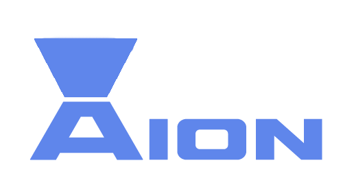

  

# The Aion DSL extension

Aion is DSL language for managing .ics files. Check resources for finding out more.

### Resources

- Extension install link: https://marketplace.visualstudio.com/items?itemName=aion-dsl-support.aion
- Language repository: https://github.com/aionlang/aion
- Extension source code: https://github.com/aionlang/aion-vscode

This is the extensition for language support for the Aion. If allows showing the icon of Aion near `.aion` files. 

### Features of the extension:

- Syntax highlighting
- Aion Icon displaying next to Aion files
- Parser errors displaying

Consult the official documentation of Aion repository https://github.com/aionlang/aion.

